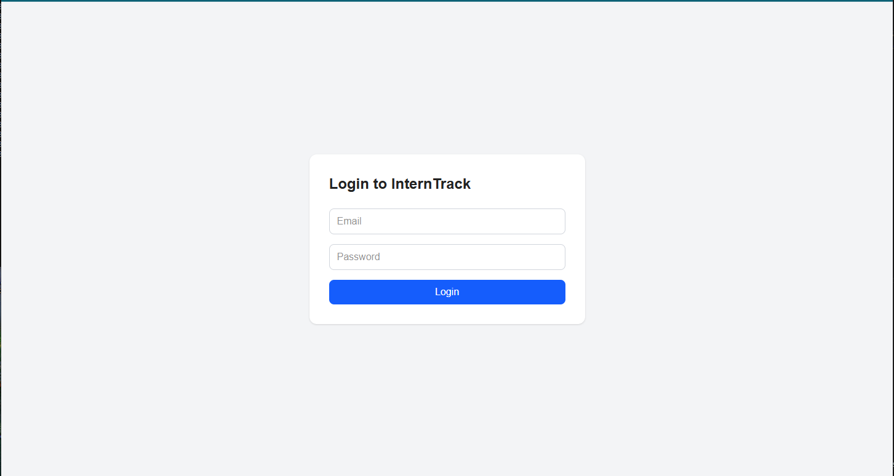
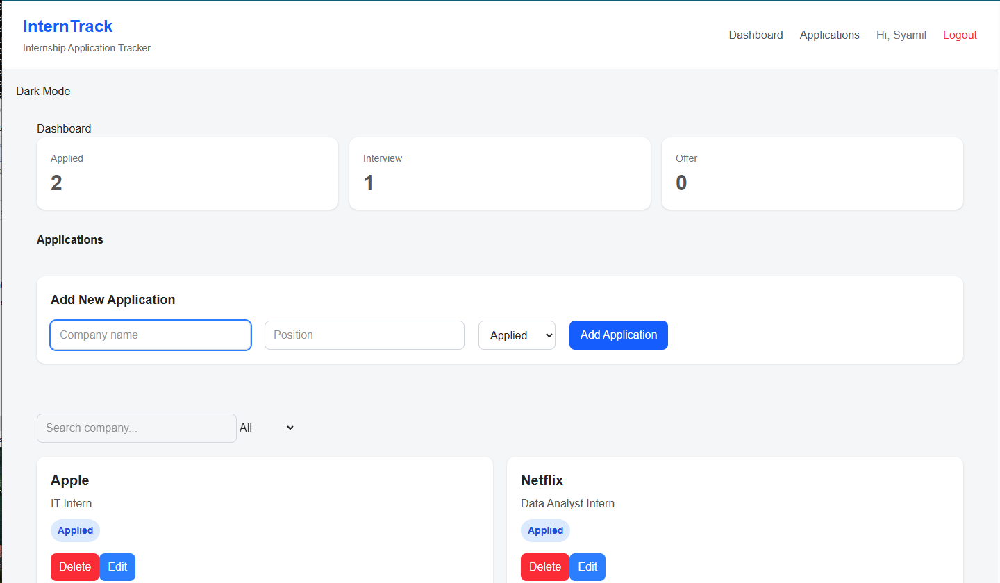
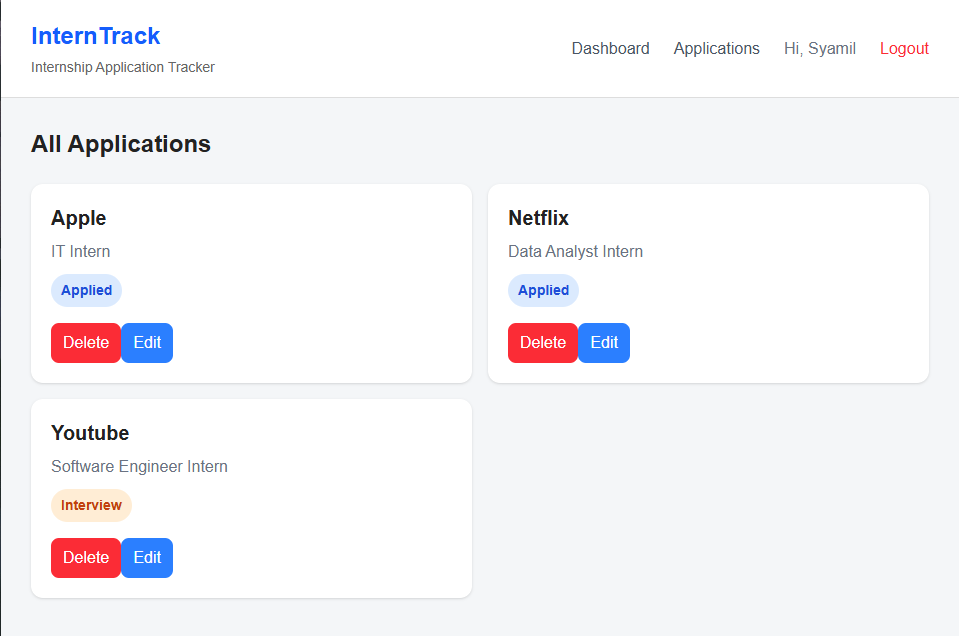

# InternTrack

InternTrack is a full-stack internship application tracking system built to help users manage and monitor their internship or job applications in one place.

The project was developed as a portfolio project to demonstrate modern full-stack web development using React, TypeScript, Redux Toolkit, Express, PostgreSQL, Prisma, JWT authentication, automated testing, and modern frontend tooling.

## Screenshots

### Login



### Dashboard



### Application Management



## Features

- User registration and login
- JWT authentication
- Protected routes
- User-specific internship applications
- Add new applications
- Edit existing applications
- Delete applications
- Search applications
- Filter applications by status
- Applied, Interview, and Offer statuses
- Responsive interface
- Dark and light theme
- Loading, error, and empty states
- Persistent authentication
- 404 page

## Tech Stack


## System Architecture

InternTrack follows a client-server architecture.

```text
┌──────────────────────────────┐
│          React UI            │
│ React + TypeScript + Tailwind│
└──────────────┬───────────────┘
               │
               │ Redux Toolkit
               │ Application State
               ▼
┌──────────────────────────────┐
│           Axios              │
│      HTTP / REST API         │
│      JWT Bearer Token        │
└──────────────┬───────────────┘
               │
               ▼
┌──────────────────────────────┐
│      Express Backend         │
│   Node.js + TypeScript       │
│                              │
│ Authentication Middleware    │
│ REST API Routes              │
└──────────────┬───────────────┘
               │
               │ Prisma ORM
               ▼
┌──────────────────────────────┐
│         PostgreSQL           │
│                              │
│ Users                        │
│ Applications                 │
└──────────────────────────────┘


##  Authentication Flow

Register / Login
      ↓
Express verifies credentials
      ↓
JWT generated
      ↓
Token stored by frontend
      ↓
Axios sends:
Authorization: Bearer <token>
      ↓
Backend verifies token
      ↓
User-specific data returned

## Application Data Flow

User adds / edits / deletes application
                ↓
             React
                ↓
          Axios request
                ↓
         Express REST API
                ↓
            Prisma
                ↓
          PostgreSQL
                ↓
        API response
                ↓
         Redux updated
                ↓
          UI updated


### Frontend

- React
- TypeScript
- Redux Toolkit
- React Router
- Tailwind CSS
- Axios
- Vite

### Backend

- Node.js
- Express
- TypeScript
- Prisma ORM
- PostgreSQL
- JWT
- bcrypt

### Testing

- Jest
- React Testing Library
- Cypress
- Storybook

### Development Tools

- ESLint
- Babel
- Webpack
- Git

## Project Structure

```text
interntrack/
├── src/
├── backend/
├── cypress/
├── .storybook/
├── webpack-learning/
└── README.md


## Getting Started

### Prerequisites

Make sure these are installed:

- Node.js
- npm
- Git

### 1. Clone the repository

```bash
git clone <your-github-repository-url>
cd interntrack
```

### 2. Install frontend dependencies

```bash
npm install
```

### 3. Install backend dependencies

```bash
cd backend
npm install
```

Then return to the main project folder:

```bash
cd ..
```

### 4. Configure environment variables

Create a `.env` file in the main InternTrack folder:

```env
VITE_API_URL=http://localhost:3000/api
```

Create another `.env` inside the `backend` folder:

```env
DATABASE_URL=your_postgresql_database_url
JWT_SECRET=your_secret_key
```

Do not commit `.env` files containing secrets to GitHub.

### 5. Start the database

From the backend folder:

```bash
cd backend
npx prisma dev
```

Keep this terminal running.

### 6. Start the backend

Open another terminal:

```bash
cd backend
npm run dev
```

The API runs at:

```text
http://localhost:3000
```

### 7. Start the frontend

Open another terminal from the main project folder:

```bash
npm run dev
```

The frontend normally runs at:

```text
http://localhost:5173
```

### 8. Open InternTrack

Visit:

```text
http://localhost:5173
```

Register a new account and start managing internship applications.


## API Endpoints

### Authentication

| Method | Endpoint | Description |
|---|---|---|
| POST | `/api/auth/register` | Register a new user |
| POST | `/api/auth/login` | Authenticate user and return JWT |
| GET | `/api/auth/me` | Return the currently authenticated user |

### Applications

All application routes require a valid JWT.

| Method | Endpoint | Description |
|---|---|---|
| GET | `/api/applications` | Get applications belonging to the current user |
| POST | `/api/applications` | Create a new application |
| PUT | `/api/applications/:id` | Update an existing application |
| DELETE | `/api/applications/:id` | Delete an application |

### Authentication Header

Protected requests use:

```http
Authorization: Bearer <JWT_TOKEN>
```

### Example Application

```json
{
  "id": 1,
  "company": "Google",
  "position": "Software Engineer Intern",
  "status": "Applied"
}
```

Available application statuses:

```text
Applied
Interview
Offer
```

## Testing

InternTrack includes multiple levels of automated testing to verify application logic, UI behaviour, routing, and complete user flows.

### Unit & Component Testing

Jest and React Testing Library are used for:

- Redux reducer testing
- Authentication state testing
- Application CRUD state testing
- Protected route behaviour
- Component rendering
- Button interaction testing
- 404 page testing

Run all Jest tests:

```bash
npm test
```

Generate the coverage report:

```bash
npm run coverage
```

### End-to-End Testing

Cypress is used to test complete browser-based user flows.

Current E2E coverage includes:

- Login flow
- Loading application data
- Creating an application
- Editing an application
- Deleting an application
- Mocking backend API responses with `cy.intercept()`

Open Cypress interactively:

```bash
npm run cy:open
```

Run all Cypress tests automatically:

```bash
npm run cy:run
```

### Storybook

Storybook is used for isolated component development and interaction testing.

`ApplicationCard` stories currently demonstrate:

- Applied status
- Interview status
- Offer status
- Editable component controls
- Edit button interaction testing
- Delete button interaction testing

Start Storybook:

```bash
npm run storybook
```

Create a production Storybook build:

```bash
npm run build-storybook
```

### Code Quality

ESLint is used to maintain code quality and identify potential issues.

```bash
npm run lint
```

The project currently passes:

```text
✓ Jest tests
✓ Cypress E2E tests
✓ ESLint checks
✓ TypeScript production build
✓ Storybook production build
```